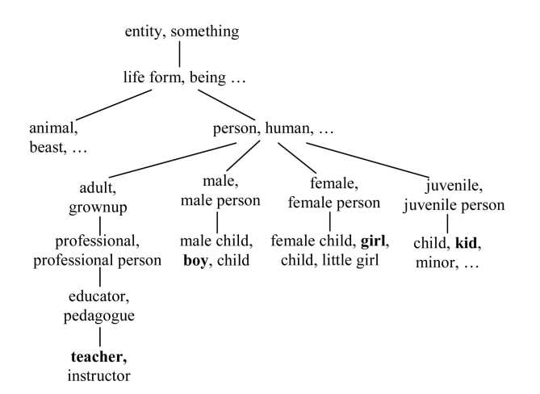

# Sentence-Similarity

<!-- ## Introduction
This repository implements method for calculating similarities between small sentences. Implementation is divided in 2 files: 
* `main.py` - for implementing functionalities
* `main.ipynb` - for testing -->

## Introduction
Sentences consist of *words*, which are combined and give them different meanings. So we should pay special attention to words. But not only that. Word order is also very important. As stated in the paper, let's look at the following example:  
* ***A quick brown dog jumps over the lazy fox.***  
* ***A quick brown fox jumps over the lazy dog.***  

Words in these sentences belong to the same corpus and only order of words *fox* and *dog* is reverted. Naive implementation would consider these 2 sentences to be the same because of the words used in them. 
So our implementation will be focused on: 

* *semantic word similarity*
* *order similarity*

## Semantic word similarity
Semantic similarity is one of the bigger chalanges in this implementation.
We can easily check if 2 words are the same based on their characters, but can we tell when two words are similar (have similar meaning)? Let's take a look at the following graph:

  
Given 2 words `w1` and `w2`, we want to find their semantic similarity `s(w1,w2)`. This can be done by calculating the shortest distances between words in this graph. For example, shortest distance between words *boy* and *girl* is 4 (path from boy: male - person - female - girl).  
Another example shows that distance between *boy* and *teacher* is 6, but also that distance between *boy* and *animal* is 4. So, word *boy* is semanticly closer to word *animal* than to word *teacher*, which makes no sense. One easy way to fix this, is to take into consideration the depth of the root for two words in question, because words in upper nodes of our graph are more abstract, and have more meanings attached to them. 
Finally, semantic similarity function will look like this:   
`s(w1, w2) = f(l, h)`  
* l - shortest path distance between words
* h - depth of the common root of these two words. 

We will assume that above formula could be rewritten like:  
`s(w1, w2) = f1(l) * f2(h)`

### Shortest path distance
Having previous counterexample for distance similarity excluded (for *animal*, *teacher* and *boy*), it makes complete sense that shorter the distance between words, the more similar they are. So, `f1(l)` should be monotonically decreasing function as *l* increases. We will use the following function:  
<code>f1(l) = e-αl </code>

### Depth of the common root
Here we will add more meaning to bigger depth, so unlike the `Shortest path distance` section, `f2(h)` will be monotonically increasing function with the respect to the parameter h. We will use hyperbolic tangent function:

<code>f2(h) = (eβh - e-βh) / (eβh + e-βh) </code>

Finally, word similarity function formula:

<code>  s(w1,w2) =  e-αl * (eβh - e-βh) / (eβh + e-βh) </code>  
where α and β have values in in inteval [0, 1].

### Semantic similarity of sentences
Now that we have similarity between words in our sentences, we will describe procedure of determining semantic similarities between sentences.  
We create joined corpus of words from our sentences. From that corpus, 2 vectors are created. Each element in vector corresponds to special frequency this word has in the `Brown dataset`. For more info, check implementation of 
`get_semantic_vector` function.  
After these two vectors are formed, we find cosine distance between them, and hence forward we will call this result <code>Ss</code>

## Word order similarity
As we have seen in the `Introduction` section, word order is also very important when determining similarity between sentences. In the following part of this section, we will describe how to calculate word order similarity.
First from tokens in our sentences, we create joined corpus. Then, we form 2 vectors of indexes of words from the sentences in the joined corpus. For example:

* `s1 = A quick brown dog jumps over the lazy fox.`
* `s2 = A quick brown fox jumps over the lazy dog.`

From `s1` and `s2` we form `corpus = [A, quick, brown, dog, jumps, over, the, lazy, fox, .]`  
From `corpus` and `s1` we form  `v1 = [1, 2, 3, 4, 5, 6, 7, 8, 9]`  
From `corpus` and `s2` we form `v2 = [1, 2, 3, 9, 5, 6, 7, 8, 4]`

Finally, word order similarity will be calculated using:  
<code> So = 1 - ||v1 - v2|| / ||v1 + v2|| </code>

But what if word from corpus is not in the sentences? Then we find the most similar word in the sentence to the word in corpus, and if it's similarity passes predefined threshold `η`, we use the index of that word instead.

## Combining similarities
Combined formula for calculating similarity between sentences is:
<code>
δ * Ss + (1 - δ) * So 
</code>, where δ is hyperparamter.

## Links
Link to the [original paper](https://www.researchgate.net/publication/232645326_Sentence_Similarity_Based_on_Semantic_Nets_and_Corpus_Statistics#:~:text=The%20semantic%20similarity%20of%20two,database%20and%20from%20corpus%20statistics.&text=Experiments%20on%20two%20sets%20of,significant%20correlation%20to%20human%20intuition.)

